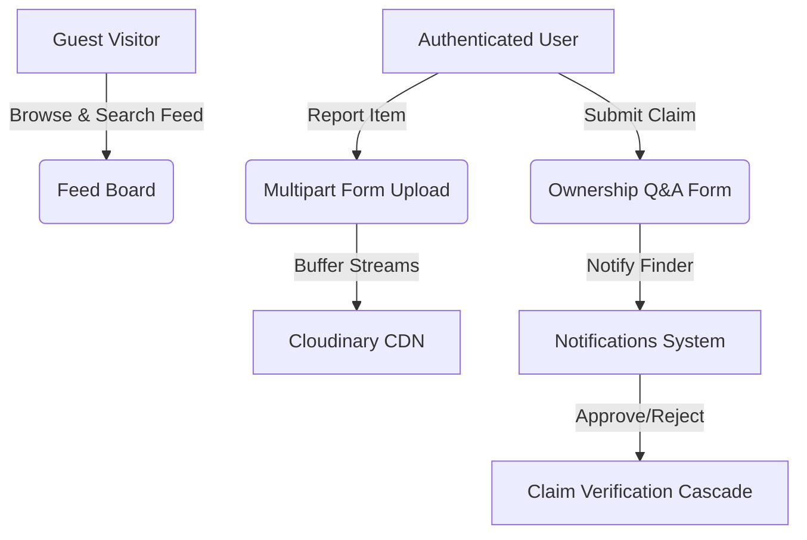

# 🔍 Retracer — Lost & Found Network

[](https://mongodb.com)
[](https://opensource.org/licenses/MIT)
[](#)

> Helping communities reconnect with their lost belongings through a secure, claims-verified, and collaborative digital repository.

---

## 📌 Project Overview
**Retracer** is a production-grade full-stack MERN (MongoDB, Express, React, Node.js) web application designed to digitize and secure the lost-and-found workflow. 

Instead of relying on scattered social media posts or physical notice boards where information quickly gets lost, Retracer provides a centralized, searchable repository. Features include JWT authentication, role-based access controls, multiple image uploads, threaded discussions, claim request notifications, and custom ownership-verification questionnaires to prevent fraudulent claims.

---

## 🛠️ Technology Stack

| Component | Technology | Description |
| :--- | :--- | :--- |
| **Frontend** | React 19, Vite, Tailwind CSS v4 | Responsive, SPA with state-driven layouts. |
| **Backend** | Node.js, Express.js (MVC Pattern) | RESTful API gateway with token-based session handling. |
| **Database** | MongoDB, Mongoose | Document-oriented schemas with validation rules. |
| **Storage** | Cloudinary CDN, Multer | Buffered multi-image parsing and secure image hosting. |
| **Security** | JSON Web Tokens (JWT), bcryptjs | Stateless session encryption and password hashing. |

---

## ⚙️ Core Architecture & Features



### 🗝️ Key Features
*   **Authentication & Access**: JWT-based session tokens with custom `ProtectedRoute` route guards.
*   **Multipart Image Uploads**: Local buffer parsing via Multer streams straight to Cloudinary.
*   **Fraud Prevention & Q&A Claims**: Finders write unique questions (e.g. *What sticker is on the lid?*). Claimants must answer these questions to submit recovery requests.
*   **Chronological Discussion Boards**: Threaded public comments on listings to coordinate physical handovers safely.
*   **Live Notification Bell**: Auto-polling header dropdown indicating unread comments, claim entries, and claim approvals.
*   **Robust Filter & Search Controls**: Search matches by keyword, item type (`lost`/`found`), category, location, and date range.

---

## 📁 Repository Structure
```text
lost-found_network/
├── Backend/                # Express API Server
│   ├── config/             # Database connection setups
│   ├── controllers/        # Route controllers
│   ├── middlewares/        # Auth, upload, and error middleware
│   ├── models/             # Mongoose schemas
│   ├── routes/             # API endpoints
│   ├── services/           # Cloudinary & claims business logic
│   └── utils/              # Custom logger wrappers
└── Frontend/               # React Vite Client
    ├── public/             # Static SVGs and assets
    └── src/
        ├── components/     # Global layout components (Navbar, Route Guards)
        ├── context/        # Global Auth Context Provider
        ├── pages/          # Layout views (Home, Login, Dashboard, Details)
        └── utils/          # Axios configurations
```

---

## 🚀 Local Development Setup

### Prerequisites
*   [Node.js](https://nodejs.org/) (v18+ recommended)
*   [MongoDB Atlas](https://www.mongodb.com/atlas) Cluster

### 1. Clone the Repository
```bash
git clone https://github.com/Tejpraval/lost-found_network.git
cd lost-found_network
```

### 2. Configure the Backend
1. Navigate to the Backend folder:
   ```bash
   cd Backend
   npm install
   ```
2. Create a `.env` file in the `Backend/` folder and paste the following parameters:
   ```env
   PORT=5000
   NODE_ENV=development
   MONGODB_URI=mongodb+srv://<username>:<password>@cluster0.mongodb.net/lost-found-network
   JWT_SECRET=your_long_secure_jwt_secret_key
   JWT_EXPIRES_IN=7d
   CLIENT_URL=http://localhost:5173

   # Cloudinary Credentials (For Image Uploads)
   CLOUDINARY_CLOUD_NAME=your_cloudinary_cloud_name
   CLOUDINARY_API_KEY=your_cloudinary_api_key
   CLOUDINARY_API_SECRET=your_cloudinary_api_secret
   ```
3. Run the Backend:
   ```bash
   npm run dev
   ```

### 3. Configure the Frontend
1. Open a new terminal and navigate to the Frontend folder:
   ```bash
   cd ../Frontend
   npm install
   ```
2. Run the Frontend:
   ```bash
   npm run dev
   ```
3. Open your browser and explore the platform at `http://localhost:5173/`.

---

## 📄 License
Distributed under the MIT License. See `LICENSE` for more information.
