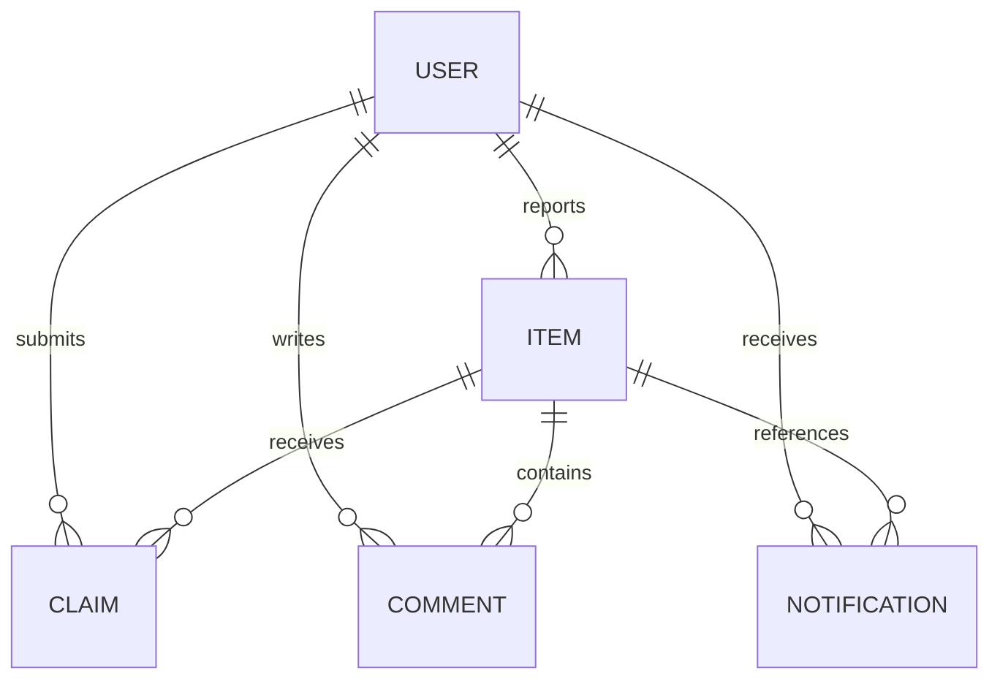
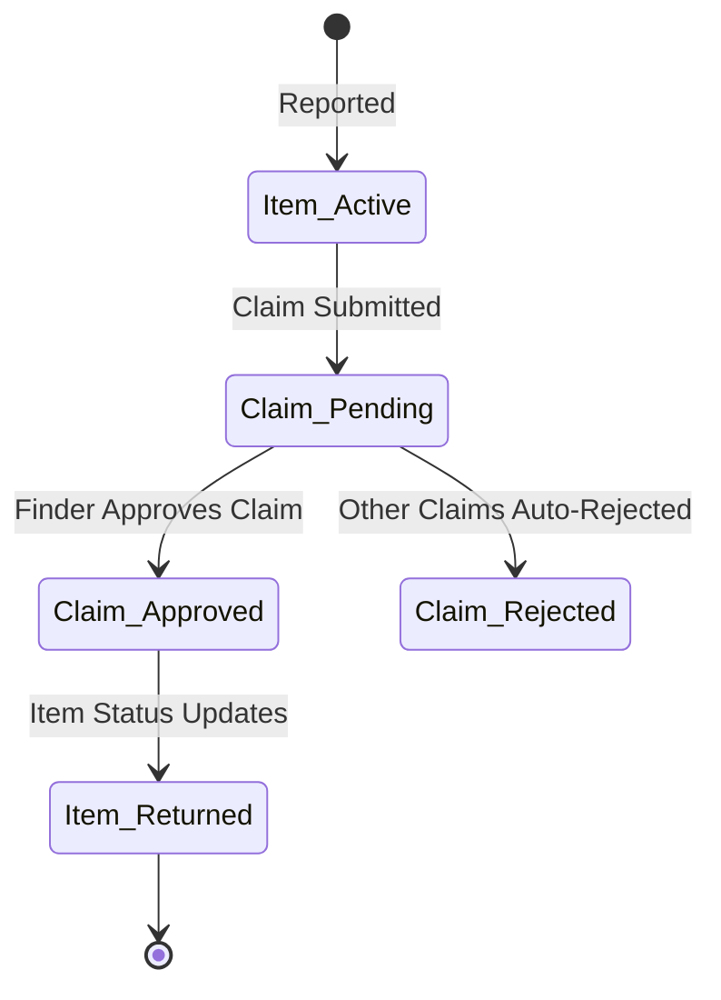

# 🔍 Retracer — Secure Lost & Found Network

[](https://mongodb.com)
[](https://opensource.org/licenses/MIT)
[](#)
[](https://nodejs.org/)
[](https://react.dev/)

Retracer is a production-quality, secure MERN (MongoDB, Express, React, Node.js) web application designed to digitize, centralize, and safeguard the process of reporting, claiming, and recovering lost belongings within private and public communities.

---

## 📌 Table of Contents
1. [Core Features](#-core-features)
2. [Technical Architecture](#-technical-architecture)
3. [Database Schema & Relationships](#-database-schema--relationships)
4. [API Endpoints Specification](#-api-endpoints-specification)
5. [Core Logic Workflows](#-core-logic-workflows)
6. [Local Development & Configuration](#-local-development--configuration)
7. [User Access Control Matrix](#-user-access-control-matrix)
8. [Production Deployment Blueprint](#-production-deployment-blueprint)

---

## 🌟 Core Features

*   **🔒 JWT Authentication**: Secure sessions with bcrypt hashed passwords and client-side HTTP request interceptors.
*   **📷 Multipart Media Upload**: Direct memory-buffered image upload parsing straight to Cloudinary.
*   **🛡️ Fraud-Resistant Claims**: Custom verification questions written by the finder that the claimant must answer to submit a recovery request.
*   **💬 Collaborative Discussion Board**: Threaded commentary logs associated with listings to coordinate handovers.
*   **🔔 Live Notifications Bell**: Context-aware notifications alerting users of comments, incoming claim requests, and approvals.
*   **🔍 Smart Query Filters**: Filter feed items by keyword match, category, location, lost/found tags, and date limits.

---

## ⚙️ Technical Architecture

Retracer implements a clean decoupled architecture separated into a headless backend gateway and a single-page web client:

```text
lost-found_network/
├── Backend/                    # Express REST API Server
│   ├── config/                 # MongoDB database initializers
│   ├── controllers/            # Request handlers matching REST verbs
│   ├── middlewares/            # Session validation, file parsing, and error interception
│   ├── models/                 # Mongoose schema models
│   ├── routes/                 # Express routing maps
│   ├── services/               # Image uploads & claims processor services
│   └── utils/                  # Winston logger configs
└── Frontend/                   # React Vite Client
    ├── public/                 # Static vector assets
    └── src/
        ├── components/         # Layout modules (Navbar, ProtectedRoute)
        ├── context/            # AuthContext global session state
        ├── pages/              # View screens (Home, Login, Dashboard, ItemDetails)
        └── utils/              # Custom Axios instances with interceptor hooks
```

---

## 🗄️ Database Schema & Relationships

The database is modeled in MongoDB using Mongoose, establishing strict relational mappings to guarantee data consistency:



### 1. User Schema (`User.js`)
*   `name`: String, required.
*   `email`: String, required, unique, lowercased.
*   `password`: String, required, select: false (hidden in general queries).
*   `role`: String, enum: `['user', 'admin']`, default: `'user'`.
*   `status`: String, enum: `['active', 'suspended']`, default: `'active'`.

### 2. Item Schema (`Item.js`)
*   `title`: String, required, indexed for searches.
*   `description`: String, required.
*   `type`: String, enum: `['lost', 'found']`, required.
*   `category`: String, required (e.g., Electronics, Documents).
*   `location`: String, required.
*   `date`: Date, required.
*   `images`: Array of Strings (Cloudinary URLs).
*   `reporter`: ObjectId (ref: `User`), required.
*   `status`: String, enum: `['pending', 'active', 'claimed', 'returned', 'rejected']`, default: `'pending'`.
*   `identifyingQuestions`: Array of Strings.

### 3. Claim Schema (`Claim.js`)
*   `item`: ObjectId (ref: `Item`), required.
*   `claimer`: ObjectId (ref: `User`), required.
*   `answers`: Array of Strings (corresponds to the item's identifyingQuestions).
*   `message`: String.
*   `status`: String, enum: `['pending', 'approved', 'rejected']`, default: `'pending'`.

### 4. Comment Schema (`Comment.js`)
*   `item`: ObjectId (ref: `Item`), required.
*   `author`: ObjectId (ref: `User`), required.
*   `content`: String, required.

### 5. Notification Schema (`Notification.js`)
*   `recipient`: ObjectId (ref: `User`), required.
*   `sender`: ObjectId (ref: `User`), required.
*   `type`: String, enum: `['claim_created', 'claim_approved', 'claim_rejected', 'comment_created']`, required.
*   `item`: ObjectId (ref: `Item`), required.
*   `isRead`: Boolean, default: `false`.

---

## 🔌 API Endpoints Specification

### 🔑 Authentication & Users
| Method | Route | Description | Auth Required |
| :--- | :--- | :--- | :---: |
| **POST** | `/api/v1/auth/register` | Create a new user account | No |
| **POST** | `/api/v1/auth/login` | Authenticate credentials and return JWT | No |
| **GET** | `/api/v1/users/me` | Fetch currently logged-in user profile | Yes |

### 🔍 Listings (Items)
| Method | Route | Description | Auth Required |
| :--- | :--- | :--- | :---: |
| **GET** | `/api/v1/items` | Fetch filtered & paginated listing feed | No |
| **POST** | `/api/v1/items` | Create new listing (multipart image upload) | Yes |
| **GET** | `/api/v1/items/:id` | Fetch specific item details | No |
| **DELETE** | `/api/v1/items/:id` | Delete listing (Author or Admin only) | Yes |

### 🛡️ Claims
| Method | Route | Description | Auth Required |
| :--- | :--- | :--- | :---: |
| **POST** | `/api/v1/claims` | Submit an ownership claim with questionnaire answers | Yes |
| **GET** | `/api/v1/claims/item/:itemId` | Fetch claims submitted for an item (Finder only) | Yes |
| **GET** | `/api/v1/claims/my-claims` | Fetch claims submitted by the logged-in user | Yes |
| **PATCH** | `/api/v1/claims/:id/process` | Approve or reject a claim (Finder only) | Yes |

### 💬 Comments
| Method | Route | Description | Auth Required |
| :--- | :--- | :--- | :---: |
| **POST** | `/api/v1/comments` | Post a comment on a listing | Yes |
| **GET** | `/api/v1/comments/item/:itemId` | Fetch all comments for a listing | No |
| **DELETE** | `/api/v1/comments/:id` | Delete a comment (Author, Reporter, or Admin) | Yes |

### 🔔 Notifications
| Method | Route | Description | Auth Required |
| :--- | :--- | :--- | :---: |
| **GET** | `/api/v1/notifications` | Fetch unread notifications list | Yes |
| **PATCH** | `/api/v1/notifications/:id/read` | Mark a specific notification as read | Yes |
| **PATCH** | `/api/v1/notifications/read-all` | Mark all notifications as read | Yes |

---

## ⚙️ Core Logic Workflows

### 1. Verification & Claim Cascades
When a finder reports an item as `found`, they submit an array of verification questions. 
To claim the item, another user submits answers matching those questions. When the finder reviews the answers and clicks **Approve**:
1. The target **Claim** status transitions to `approved`.
2. The parent **Item** status updates to `returned`.
3. **Automated Cascade**: All other pending claims for that item are automatically updated to `rejected`.
4. A notification is triggered for the approved owner and all rejected claimants.



### 2. Media Upload Pipeline
Image uploads utilize a memory-buffered Multer configuration:
*   Files are parsed on the backend server and held in RAM as a buffer.
*   The upload service writes the buffer directly to Cloudinary over a secure stream.
*   **Fallback Strategy**: If Cloudinary credentials are not configured in `.env`, the system automatically logs a notice and yields random high-quality Unsplash/Picsum placeholders so that the local development workflow is never blocked.

---

## 🚀 Local Development & Configuration

### Prerequisites
*   [Node.js](https://nodejs.org/) (v18+ recommended)
*   [MongoDB Atlas](https://www.mongodb.com/atlas) Cluster

### 1. Clone & Dependencies Installation
```bash
git clone https://github.com/Tejpraval/lost-found_network.git
cd lost-found_network
```

*Install Backend Dependencies:*
```bash
cd Backend
npm install
```

*Install Frontend Dependencies:*
```bash
cd ../Frontend
npm install
```

### 2. Configuration Setup
Create a file named `.env` inside the `Backend/` directory and populate it with the following configuration variables:
```env
PORT=5000
NODE_ENV=development
MONGODB_URI=mongodb+srv://<username>:<password>@cluster0.mongodb.net/lost-found-network
JWT_SECRET=your_long_secure_jwt_secret_key
JWT_EXPIRES_IN=7d
CLIENT_URL=http://localhost:5173

# Cloudinary Credentials (For Live Image Uploads)
CLOUDINARY_CLOUD_NAME=your_cloudinary_cloud_name
CLOUDINARY_API_KEY=your_cloudinary_api_key
CLOUDINARY_API_SECRET=your_cloudinary_api_secret
```

### 3. Launch Development Environments
*Run the Backend Server (Terminal 1):*
```bash
cd Backend
npm run dev
```

*Run the Frontend Client (Terminal 2):*
```bash
cd Frontend
npm run dev
```

Open your browser and navigate to `http://localhost:5173/`.

---

## 👥 User Access Control Matrix

| Action | Guest | Registered User | Admin |
| :--- | :---: | :---: | :---: |
| Browse public feed | ✅ | ✅ | ✅ |
| Search and filter items | ✅ | ✅ | ✅ |
| Register & Log in | ✅ | ✅ | ✅ |
| Report Lost/Found listings | ❌ | ✅ | ✅ |
| Write comments on board | ❌ | ✅ | ✅ |
| Submit claims & answers | ❌ | ✅ | ✅ |
| Approve claims on own items | ❌ | ✅ | ✅ |
| Delete own comments/listings | ❌ | ✅ | ✅ |
| Delete *any* listings or comments | ❌ | ❌ | ✅ |
| Suspend user accounts | ❌ | ❌ | ✅ |

---

## 🌐 Production Deployment Blueprint

### 1. Express API (Render Deployment)
*   **Root Directory**: `Backend`
*   **Build Command**: `npm install`
*   **Start Command**: `npm start`
*   **Environment Variables**: Populate all keys from your `.env` file, setting `NODE_ENV=production` and `CLIENT_URL` to your Vercel URL.

### 2. Vite React (Vercel Deployment)
*   **Root Directory**: `Frontend`
*   **Framework Preset**: `Vite`
*   **Build Command**: `npm run build`
*   **Output Directory**: `dist`
*   **Environment Variables**: Add `VITE_API_URL` pointing to your Render backend URL (e.g. `https://lost-found-backend.onrender.com/api/v1`).
